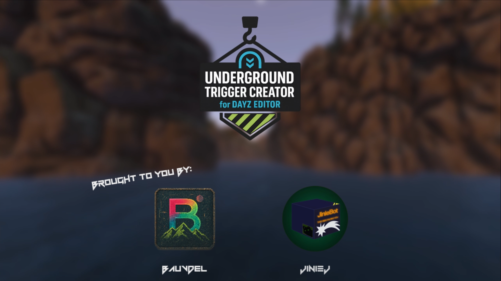

# Underground Trigger Creator for DayZ Editor

<p align="center">
  
</p>

[](https://creativecommons.org/licenses/by-nd/4.0/)
[](https://steamcommunity.com/sharedfiles/filedetails/?id=3547799357)
[](https://github.com/bauvdel/EditorUGTriggers)

> Create, test, import, and export fully functional Underground Triggers with Breadcrumbs right inside of DayZ Editor!

---

## 📸 Screenshots

| Trigger Properties | Breadcrumb Properties | Breadcrumbs in Trigger | Testing Darkness | Livonia Example |
|-----------------------|----------------------|------------------------|----------------------|------------------------------|
| [](docs/screenshot1.png) | [](docs/screenshot4.png) | [](docs/screenshot2.png) | [](docs/screenshot5.png) | [](docs/screenshot6.png) |


## ▶️ Tutorial Videos
| bauvdel's Video | JinieJ's Video |
|-----------------------|----------------------|
| [](https://www.youtube.com/watch?v=00fqSRH4lyU)| [](https://www.youtube.com/watch?v=scCh_MT0ie8) |


---

## ✨ Features

- Create and test **live working Underground Triggers** directly in DayZ Editor.
- Size triggers **independently** on **X, Y, and Z axes**.
- Configure your trigger areas with **Trigger Type**, **Eye Accommodation**, and **Interpolation Speed**.
- Configure your breadcrumbs with **Eye Accommodation**, **Raycast**, and **Radius**.
- Breadcrumbs automatically attach to **Transitional Triggers**.
- Export and import your **cfgundergroundtriggers.json**.
- Works for both **PC** and **Console** edits!
- No need to use or learn **DayZ Diag**!

---

## ⚙️ Requirements

- [Dabs Framework](https://steamcommunity.com/sharedfiles/filedetails/?id=2545327648)  
- [DayZ Editor](https://steamcommunity.com/sharedfiles/filedetails/?id=2250764298)  

> **IMPORTANT:** This mod is for **DayZ Editor use only** — not intended to run on a server or standalone and will NOT work. 

---

## 🛠 Installation

**Steam Workshop**  
Subscribe on Steam Workshop: [Workshop Link](https://steamcommunity.com/sharedfiles/filedetails/?id=3547799357)

**Manual**  
1. Clone or download this repository.
2. Pack mod using Addon Builder, Mikeros, etc.  
2. Place .pbo in a `addons` folder insdie of a `@EditorUGTriggers` foler in your DayZ mods directory, or wherever you want to load local mods from.  
3. Load **DayZ Editor** and **Dabs Framework** at a minimum to allow this mod to function.

---

### ❔How do Underground Triggers Work?
Read the **Bohemia Wiki Page:** [Underground Areas Configuration](https://community.bistudio.com/wiki/DayZ:Underground_Areas_Configuration)

---
## 🚀 Usage
### Placing Triggers
1. Place a `UGTriggerObject`.
2. Adjust **position**, **rotation**, and **size** (X, Y, Z).
3. Set:
   - **Trigger Type**: Outer, Inner, Transitional
   - **Eye Accommodation** (0.0–1.0)
   - **Interpolation Speed** (0.0–1.0)

### Placing Breadcrumbs
1. Place `UGBreadcrumb` **inside a Transitional Trigger**.
2. Adjust position.
3. Set:
   - **Eye Accommodation** (0.0–1.0)
   - **Use Raycast** (True or False)
   - **Radius** (-1 = default)

### Copy/Paste/Cut/Duplicate
1. All **Trigger** and **Breadcrumb** objects should be Copied, Pasted, Cut, and Duplicated using the modded clipboard system to keep the triggers and data saved.
2. Use **Modifier** key <kbd>Shift</kbd> instead of <kbd>CTRL</kbd> with the default cut, copy, paste, and duplicate keybinds (<kbd>C</kbd> , <kbd>V</kbd>,  <kbd>X</kbd>, <kbd>J</kbd>)
3. All keybinds listed below. 

### Import/Export
- Importing and Exporting is done through the Editor File Menu, just as if you were importing or exporting anything else. 
- Look for the Import/Export UG Triggers (*.json) option in the menu. 
- Triggers and breadcrumbs can ONLY be saved this way. Saving them as a .dze will not make them work.

---

## ⌨️ Default Keybinds

- **Keybinds** can be adjusted in the Options Menu. We know that not everyone has a numpad!

**Trigger Resizing**

| Action            | Keybind  |
|-------------------|----------|
| Decrease Length   | Numpad <kbd>7</kbd> |
| Increase Length   | Numpad <kbd>9</kbd> |
| Decrease Width    | Numpad <kbd>4</kbd> |
| Increase Width    | Numpad <kbd>6</kbd> |
| Decrease Height   | Numpad <kbd>1</kbd> |
| Increase Height   | Numpad <kbd>3</kbd> |

- **Size** can also be adjusted in the UGTriggerObject Properties Window.

**Trigger/Breadcrumb Commands**
| Action            | Keybind  |
|-------------------|----------|
| Copy Triggers      | <kbd>Shift</kbd> + <kbd>C</kbd> |
| Paste Triggers     | <kbd>Shift</kbd> + <kbd>V</kbd> |
| Cut Triggers       | <kbd>Shift</kbd> + <kbd>X</kbd> |
| Duplicate Triggers | <kbd>Shift</kbd> + <kbd>J</kbd> |

>IMPORTANT: Due to the way Copy/Cut/Paste work, you may run in to some issues with the objects repopulating their properties if using Undo/Redo functions within Editor.

---

## 📂 Import / Export

Files are imported/exported from the default **DayZ Editor** files directory.  
# Default export format:

```json
{
    "Triggers": [
        {
            "Position": [
                5351.25537109375,
                339.27191162109377,
                9558.80859375
            ],
            "Orientation": [
                0.0,
                0.0,
                -0.0
            ],
            "Size": [
                4.0,
                3.0,
                4.0
            ],
            "EyeAccommodation": 1.0,
            "InterpolationSpeed": 1.0,
            "Breadcrumbs": [
                {
                    "Position": [
                        5350.4609375,
                        337.9962158203125,
                        9558.0341796875
                    ],
                    "EyeAccommodation": 1.0,
                    "UseRaycast": 1,
                    "Radius": -1.0
                },
                {
                    "Position": [
                        5351.9423828125,
                        337.9580383300781,
                        9558.0771484375
                    ],
                    "EyeAccommodation": 1.0,
                    "UseRaycast": 1,
                    "Radius": -1.0
                }
            ]
        }
    ]
}
```

---

## 🔮 Suggested Workflow

Typical underground trigger setup:
1. Start with **Outer Trigger** at entrance.
2. Pass through **Transitional Trigger** (with Breadcrumbs).
3. End in **Inner Trigger** at deepest point.
4. For alternate exits, add another **Transitional** → **Outer** path.
>Please read the **Bohemia Wiki Page:** [Underground Areas Configuration](https://community.bistudio.com/wiki/DayZ:Underground_Areas_Configuration) for more information.
---

## 🐛 Help and Support

We both have full time jobs, but we will do our best to keep this updated and fix bugs as they happen. Please find us on discord or create an issue on GitHub!

**Discord:** **@bauvdel** & **@JinieJ**


---

## 🐐 Credits

- Thank you to **@inclementdab** for creating DayZ Editor ❤️! 
[DayZ Editor on Steam Workshop](https://steamcommunity.com/sharedfiles/filedetails/?id=2250764298)
[DayZ Editor on Github](https://github.com/InclementDab/DayZ-Editor)

---

## 📜 License

[CC BY-ND 4.0](LICENSE) — Free to use, modify, and share non commercially..

> **No reason to repack. But you do you.**

---

## 🍺 Donate

We created this project as we felt that there was a need for such a tool to curb the barrier to entry for a task like this. 
This was made in our spare time, and we plan to continue to support and update this tool as DayZ and DayZ Editor grow and change.
If you would like to support the project, or just want to say thanks, feel free to click the links below!

- [bauvdel on Ko-fi](https://ko-fi.com/bauvdel)
- [JinieJ on BMaC](https://buymeacoffee.com/jiniej)