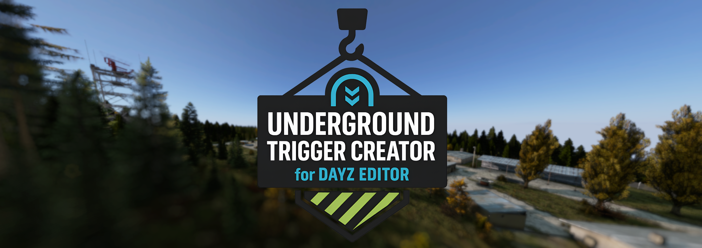
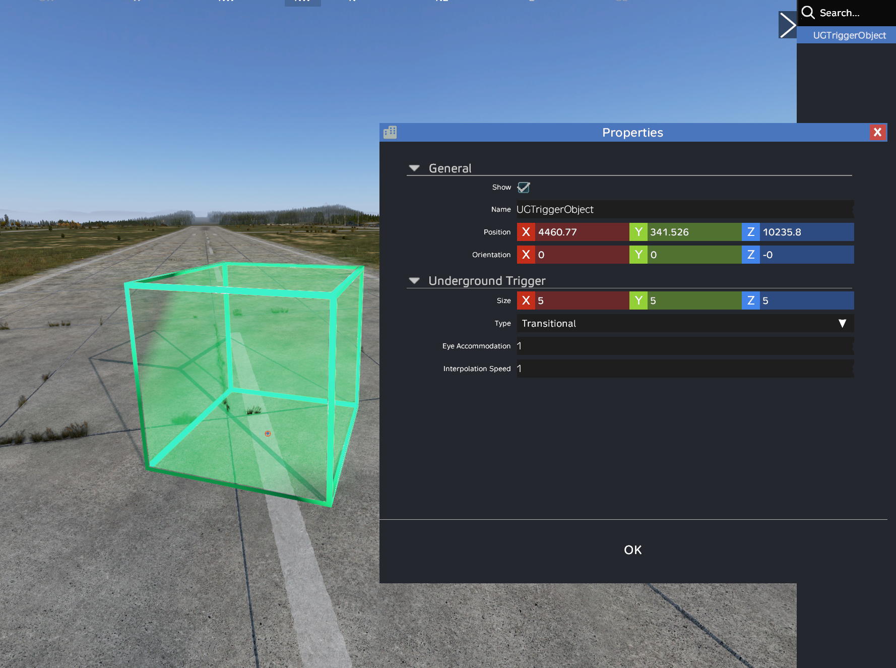
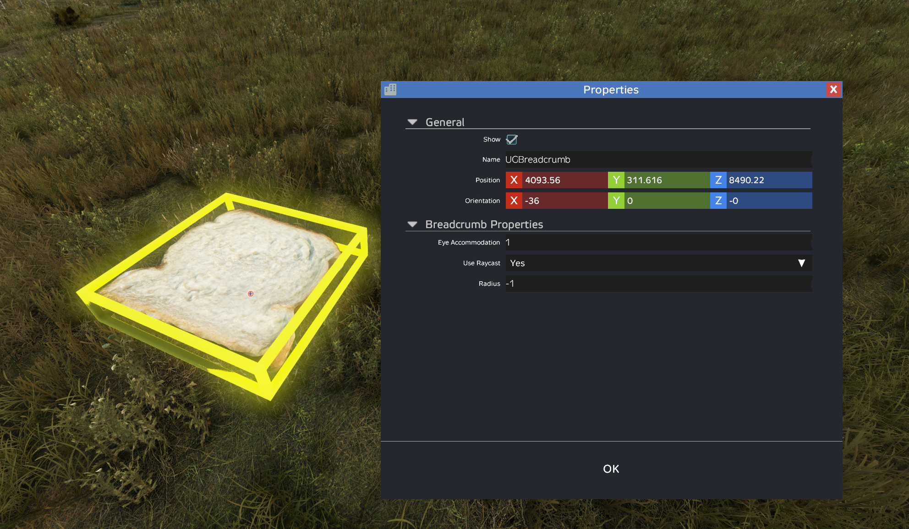
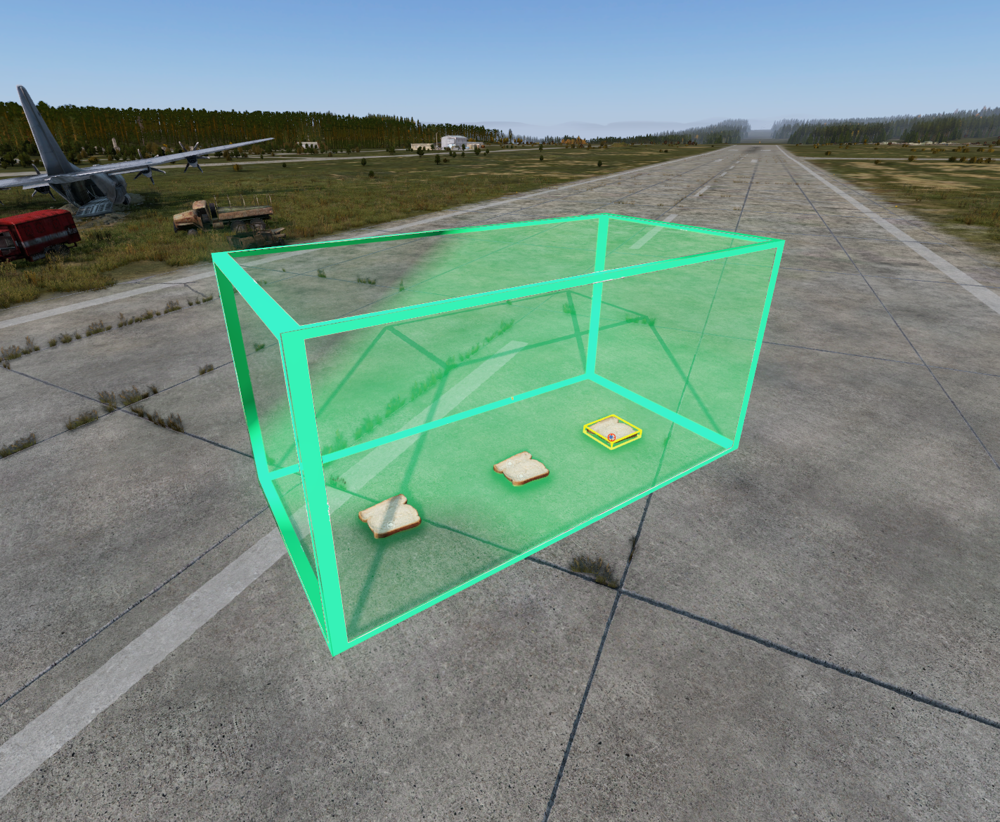
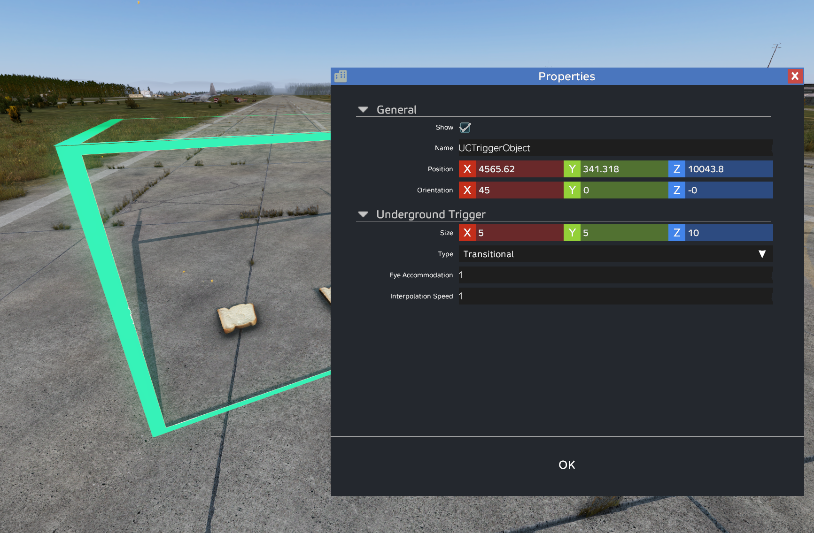

# Underground Trigger Creator for DayZ Editor

<p align="center">
  
</p>

[](LICENSE)
[](https://steamcommunity.com/sharedfiles/filedetails/?id=NEED_ID)
[](https://github.com/bauvdel/EditorUGTriggers)

> Create, test, import, and export fully functional Underground Triggers right inside of DayZ Editor for both Console and PC!

---

## 📸 Screenshots

| UG Trigger Properties | Breacrumb Properties | Breadcrumbs in Trigger | Transitional Trigger | Darkness Live |
|-----------------------|----------------------|------------------------|----------------------|---------------|
| [](docs/screenshot1.png) | [](docs/screenshot4.png) | [](docs/screenshot2.png) | [](docs/screenshot3.png) | [](docs/screenshot5.png) |


### ▶️ Tutorial Video

<a href="https://youtu.be/fJmMbl3bqE0" target="_blank">
  
</a>

### <a href="https://youtu.be/fJmMbl3bqE0" target="_blank">Watch on YouTube</a>


---

## ✨ Features

- Create and test **live working Underground Triggers** directly in DayZ Editor.
- Size triggers **independently** on **X, Y, and Z axes**.
- Condigure your trigger areas with **Trigger Type**, **Eye Accommodation**, and **Interpolation Speed**.
- Configure youre breadcrumbs with **Eye Accommodation**, **Raycast**, and **Radius**.
- Breadcrumbs automatically attach to **Transitional Triggers**.
- Export and import your **cfgundergroundtriggers.json**.
- Works for both **PC** and **Console**!

---

## ⚙️ Requirements

- [Dabs Framework](https://steamcommunity.com/sharedfiles/filedetails/?id=2545327648)  
- [DayZ Editor](https://steamcommunity.com/sharedfiles/filedetails/?id=2250764298)  

> **Note:** This mod is for **DayZ Editor use only** — not intended to run on a server or standalone.

---

## 🛠 Installation

**Steam Workshop**  
Subscribe on Steam Workshop: [Workshop Link](https://steamcommunity.com/sharedfiles/filedetails/?id=NEED_ID)

**Manual**  
1. Clone or download this repository.
2. Pack mod using Addon Builder, Mikeros, etc.  
2. Place .pbo in a `addons` folder insdie of a `@EditorUGTriggers` foler in your DayZ mods directory, or wherever you want to load local mods from.  
3. Load **DayZ Editor** and **Dabs Framework** at a minimum to allow this mod to function.

---

### ❔How do Underground Triggers Work?
Read the **Bohemia Wiki Page:** [Underground Areas Configuration](https://community.bistudio.com/wiki/DayZ:Underground_Areas_Configuration)

---
## 🚀 Usage
### Placing Triggers
1. Place a `UGTriggerObject`.
2. Adjust **position**, **rotation**, and **size** (X, Y, Z).
3. Set:
   - **Trigger Type**: Outer, Inner, Transitional
   - **Eye Accommodation** (0.0–1.0)
   - **Interpolation Speed** (0.0–1.0)

### Placing Breadcrumbs
1. Place `UGBreadcrumb` **inside a Transitional Trigger**.
2. Adjust position.
3. Set:
   - **Eye Accommodation** (0.0–1.0)
   - **Use Raycast** (True or False)
   - **Radius** (-1 = default)

---

## ⌨️ Default Keybinds

**UGTriggerObject Resizing**

| Action            | Keybind  |
|-------------------|----------|
| Decrease Length   | Numpad <kbd>7</kbd> |
| Increase Length   | Numpad <kbd>9</kbd> |
| Decrease Width    | Numpad <kbd>4</kbd> |
| Increase Width    | Numpad <kbd>6</kbd> |
| Decrease Height   | Numpad <kbd>1</kbd> |
| Increase Height   | Numpad <kbd>3</kbd> |


- **Size** can also be adjusted in the UGTriggerObject Properties Window.
- **Keybinds** can be adjusted in the Options Menu.

---

## 📂 Import / Export

Files are imported/exported from your **normal DayZ Editor files directory**.  
Default export format:

```json
{
    "Triggers": [
        {
            "Position": [
                5351.25537109375,
                339.27191162109377,
                9558.80859375
            ],
            "Orientation": [
                0.0,
                0.0,
                -0.0
            ],
            "Size": [
                4.0,
                3.0,
                4.0
            ],
            "EyeAccommodation": 1.0,
            "InterpolationSpeed": 1.0,
            "Breadcrumbs": [
                {
                    "Position": [
                        5350.4609375,
                        337.9962158203125,
                        9558.0341796875
                    ],
                    "EyeAccommodation": 1.0,
                    "UseRaycast": 1,
                    "Radius": -1.0
                },
                {
                    "Position": [
                        5351.9423828125,
                        337.9580383300781,
                        9558.0771484375
                    ],
                    "EyeAccommodation": 1.0,
                    "UseRaycast": 1,
                    "Radius": -1.0
                }
            ]
        }
    ]
}
```

---

## 🔮 Suggested Workflow

Typical underground trigger setup:
1. Start with **Outer Trigger** at entrance.
2. Pass through **Transitional Trigger** (with Breadcrumbs).
3. End in **Inner Trigger** at deepest point.
4. For alternate exits, add another **Transitional** → **Outer** path.

---

## 🐛 Support

- **Discord:** **@bauvdel** & **@JinieJ**  
- **Credits:** thanks to **@inclementdab** for creating [DayZ Editor](https://steamcommunity.com/sharedfiles/filedetails/?id=2250764298)

---

## 📜 License

[MIT License](LICENSE) — Free to use, modify, and share.

> **No reason to repack. But you do you.**
